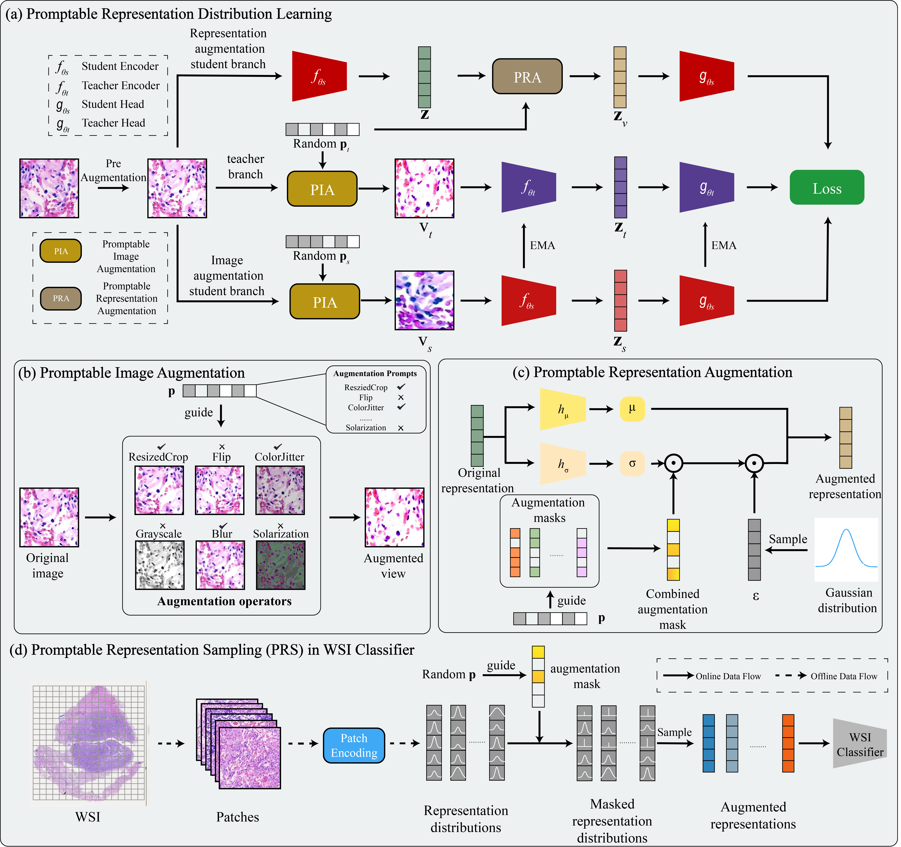

# PRDL
Code for paper 
Kunming Tang, Zhiguo Jiang, Jun Shi, Wei Wang, Haibo Wu, Yushan Zheng. Promptable Representation Distribution Learning and Data Augmentation for Gigapixel Histopathology WSI Analysis[C]//Proceedings of the AAAI Conference on Artificial Intelligence, 2025.

## Framework Overview

<p align="center">
     <br>

  *Overview of PRDL architecture*

</p>


### Pre-train

Run the codes on the slurm with multiple GPUs:
```
#!/bin/bash

#SBATCH --gres=gpu:2
#SBATCH -N 1
#SBATCH -p gpu
#SBATCH -c 24

source activate
conda activate pytorch

srun -u python -m torch.distributed.launch --nproc_per_node=2 main_pretrain.py \
    --arch vit_small \
    --data_path ./data/TCGA_EGFR \
    --data_file train.txt \
    --output_dir ./checkpoint/prdl_tcga_egfr \
    --batch_size_per_gpu 64 \
    --num_workers 12 \
    --epochs 50 \
    --saveckp_freq 1 \
    --warmup_epochs 10 \
    --use_fp16 True \
```

### Patch feature extract
```
#!/bin/bash

#SBATCH --gres=gpu:2
#SBATCH -N 1
#SBATCH -p gpu
#SBATCH -c 24
#SBATCH -o extract_egfr.log

source activate
conda activate pytorch

srun python extract_features.py \
    --arch vit_small \
    --imsize 224 \
    --step 224 \
    --feat-dim 384 \
    --max-nodes 4096 \
    --slide-dir ./medical_data/TCGA_EGFR \
    --feat-dir ./feat/TCGA_EGFR \
    --list-dir ./dataset/TCGA_EGFR \
    --slide-list TCGA_EGFR_2cls \
    --num-workers 24 \
    --batch-size 256 \
    --multiprocessing-distributed \
    --cl prdl \
    --ckp-path ./checkpoint/TCGA_EGFR/prdl_tcga_egfr/checkpoint0049.pth \
    
```

### WSI classifier training
```
#!/bin/bash

#SBATCH --gres=gpu:2
#SBATCH -N 1
#SBATCH -p com
#SBATCH -c 24

source activate
conda activate pytorch

srun -u python main.py \
    --num_classes 2 \
    --exp_code clam_mb_prdl_tcga_egfr \
    --data-dir ./feat/TCGA_EGFR/[vit_small_prdl][fs224fts384] \
    --list-dir ./dataset/TCGA_EGFR \
    --slide-list TCGA_EGFR_2cls \
    --train-list TCGA_EGFR_2cls_train_split.csv \
    --model clam_mb \
    --feats_size 384 \
    --aug \ 
    --weight ./checkpoint/TCGA_EGFR/prdl_tcga_egfr/checkpoint0049.pth \
    --status dist \
```

